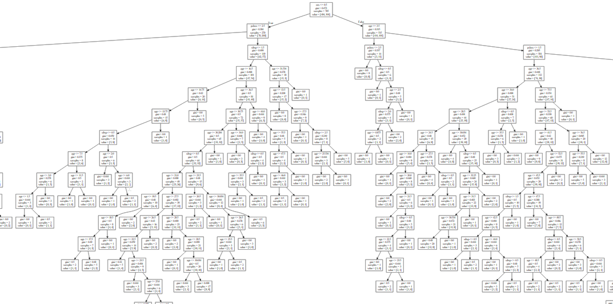
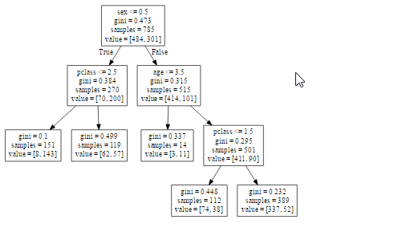

I have used titanic.csv dataset to generate Decision tree
Step 1: read in Titanic.csv and observe a few samples, 
some features are categorical and others are numerical. 
Take a random 60% samples for training and the rest 40% for test.

Step 2: fit a decision tree model using independent variables ‘pclass + sex + age + sibsp’ and dependent variable ‘survived’. 
Plot the full tree. Make sure ‘survived’ is a qualitative variable taking 1 (yes) or 0 (no) in your code. 
Step 3: check the performance of the full model: 
in‐sample and out-of‐sample accuracy, defined as: 
in‐sample percent survivors correctly predicted (on training set) 
in-sample percent fatalities correctly predicted (on training set) 
out‐of‐sample percent survivors correctly predicted (on test set)
out-of‐sample percent fatalities correctly predicted (on test set)

Step 4: use cross‐validation to find the best parameter to prune the tree. 
plot a graph with the ‘tree size’ as the x-axis and ‘number of misclassification’ as the Y-axis.
Find the minimum number of misclassification and choose the corresponding tree size to prune the tree. 

Step 5: Find:
in‐sample and out‐of‐sample accuracy, defined as
in‐sample percent survivors correctly predicted (on training set) 
in‐sample percent fatalities correctly predicted (on training set) 
out‐of‐sample percent survivors correctly predicted (on test set) 
out‐of‐sample percent fatalities correctly predicted (on test set)
